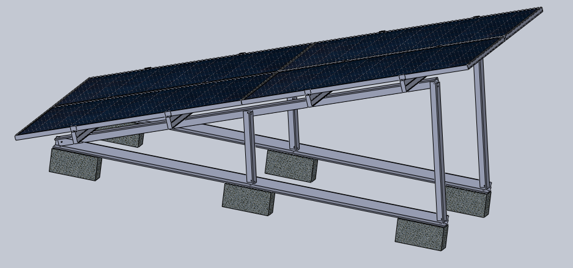

# Diseño de estructura de aluminio con cuatro páneles hechos en Solidworks

_**Los archivos de Solidworks fueron realizados en la versión del 2018.**_

Las dimensiones de los páneles son de un panel de 325W, 2x1 metros.

La estructura aún no tiene especificado un material.
